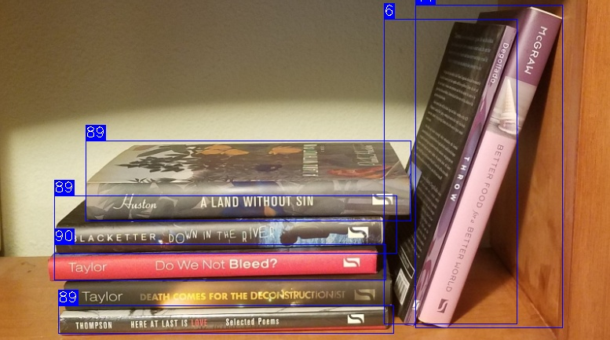

# Book Angle Detector

This is a computer vision program which detects books kept on a shelf and finds the angle that the book makes with the horizontal.

It leverages the power of OpenCV and YOLOv8 for object detection and edge detection.

## Technique Used

1. We first detect the bounding boxes for the books present in the image using YOLOv8.
1. Then, we detect the edges in each of the bounding box detected using Canny edge detection.
1. Then, we detect straight lines in these edges using Hough's method.
1. Finally, we find the angle that these lines make with the horizontal.

## Preview

